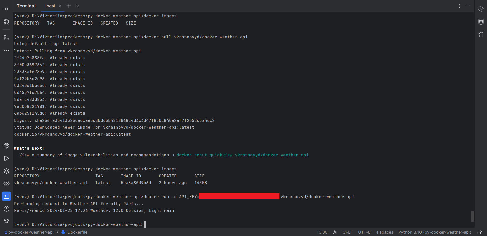

# Docker Weather API

- **Прочитайте** [інструкцію](https://github.com/mate-academy/py-task-guideline/blob/main/README.md) перед початком роботи.
- Ознайомтесь із [документацією Weather API](https://www.weatherapi.com/docs/), вона знадобиться для виконання цього завдання.

## Завдання

У цьому завданні вам потрібно реалізувати сервіс для отримання поточної погоди 
для міста Париж. Але найцікавіша частина полягає в тому, що цей сервіс має бути 
задокеризований і опублікований у Docker Hub. Використовуйте [Weather API](https://www.weatherapi.com/docs/) 
для отримання даних про погоду.

Результат цього завдання буде протестовано за допомогою таких команд:

Звичайно, замість `danylott` має бути ваш Docker ID.

Отже, вимоги до цього завдання наступні:
- Скрипт для отримання та виведення інформації про погоду має знаходитися у файлі `app/main.py`;
- Цей сервіс повинен бути задокеризований за допомогою лише `Dockerfile` (використання `docker-compose.yml` заборонено);
- Образ сервісу має бути якомога меншим;
- Використовуйте файл `.dockerignore`, щоб уникнути додавання зайвих файлів до образу Docker;
- Ви повинні використовувати модуль `requests` для взаємодії з Weather API;
- Ви повинні опублікувати свій образ у Docker Hub і переконатися, що він доступний для всіх;
- Ви маєте згенерувати `API_KEY` для використання Weather API, але він не повинен бути жорстко прописаний у `main.py`.

  Ви повинні використовувати змінні середовища для цього. Зчитуйте `API_KEY` із середовища. 
  Щоб передати змінні середовища до контейнера Docker, використовуйте прапорець `-e`.
- Не забудьте додати файл `.dockerignore` до свого pull request;
- Ви повинні *змінити* цей рядок, вказавши правильну команду для завантаження вашого образу:
  COMMAND=`docker pull <YOUR_DOCKER_ID/YOUR_IMAGE_NAME>`.

<details>
  <summary><strong>Підказка</strong></summary>
    Не використовуйте `< >` у команді Docker. Ось приклад:

```docker pull test_user/weather```
</details>

### Примітка: Перевірте свій код за допомогою цього [чекліста](checklist.md) перед тим, як завантажувати своє рішення.
